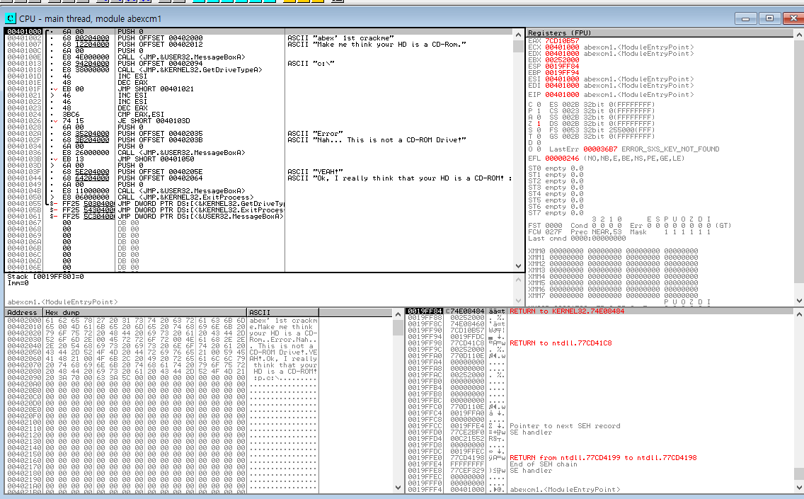
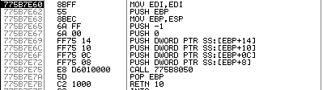

 

## 문제 : 프로그램 실행시 하드디스크가 CD롬으로 인식되도록 변경하라.

PE구조의 모든 실행파일은 헤더 영역에 엔트리 포인트가 상대 주소로 지정되어 있다. 프로그램이 로딩되면서 base 주소가 할당되고 상대주소가 더해진 곳(Base Address+RVA)에 데이터가 저장된다.
파란색이 상대주소고 노란색이 base 주소다
따라서 엔트리 포인트의 주소는 00401000이 된다.

## 올리디버거 사용하기

왼쪽 위 화면이 abexcm1.exe의 코드 영역이다.
엔트리 포인트인 00401000에서 멈춰있는 것을 볼 수 있다.
프로그램의 길이는 00401066까지 매우 짧은 편이다.

<MessageBoxA()>코드
올리 디버거에서 F8은 스텝 오버이고 F7은 스텝 인투이다.
스텝 오버는 해당 명령어를 단순히 실행하고, 스텝 인투는 그 곳에 있는 서브루틴 안으로 들어간다.
예를 들어 0040100E에 있는 명령어는 MessageBoxA() 라는 함수를 실행하는 명령어가 있다.
이곳에서 스탭 오버를 쓰면 단순히 MessageBoxA()함수를 실행해서 메세지 창이 뜨게되고 스탭 인투를 쓰면 MessageBoxA()함수 내부의 코드를 볼 수 있다.

F2로 브레이크포인트를 만들 수 있고 F9로 프로그램을 처음부터 끝까지 실행시킬 수 있다. 프로그램을 실행할 때 만약 브레이크포인트가 있다면 그곳에서 프로그램이 멈추게 된다.
단축키 ALT+TAP으로 브레이크포인트를 볼 수 있다.

## 풀이
